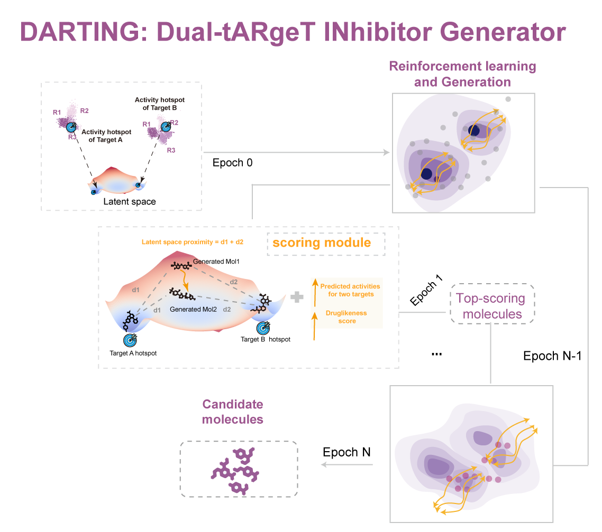

# Section 1: Setup Environment
You can follow this instructions to setup the environment  
We use conda here, you can install DARTING via conda yaml files and conda commands:  
CPU version:
```bash
conda env create -f environment.cpu.yml -n DARTING
conda activate DARTING
```
* pandas>=1.0.3
* numpy>=1.18.1
* rdkit>=2019.09.3
* joblib>=0.14.1
* scikit-learn>=0.22.1
* python==3.8.19
GPU version:
The CUDA environment additionally requires a compatible NVIDIA driver on the host machine.
```bash
conda env create -f environment.cuda.yml
conda activate DARTING
```
# Section 2: Usage
## Download training and validation data

The `data/` directory is included in the project.  
However, the training and validation files are distributed separately as GitHub release assets due to their file size.

Please download the following files and place them under `./data/`:

```bash
wget -P ./data https://github.com/yuliulab/DARTING/releases/download/guacamol_v1_train.smiles
wget -P ./data https://github.com/yuliulab/DARTING/releases/download/guacamol_v1_validation.smiles

cd ..
```

Run the following commands from the project root directory:
## Step 1: Train the VAE model in DARTING  
Using the following commands to train the model
The example command uses paths relative to the project root directory. You may change them to absolute paths as needed.
```
python run.py train \
	--train_data ./data/guacamol_v1_train.smiles \
	--log_file log.txt \
	--save_frequency 25 \
	--model_save model.pt \
	--n_epoch 200 \
	--n_batch 1024 \
	--debug \
	--d_dropout 0.2 \
	--device cpu
```
Or download the pretrained model weights directly:
```
wget https://github.com/yuliulab/DARTING/releases/download/weights/model.pt.gz
gunzip model.pt.gz
```
## Step 2: Train ligand-binding prediction models for downstream generation
Here, we use MTOR and MEK1 as examples.
Replace `<path_to_bindingdb_csv>` with the local path to your BindingDB CSV file.
```
## target A: MTOR
# Download the BindingDB dataset and save it as a CSV file.
python run.py train_ligand_binding_model \
--binding_db_path [your path to BindingDB dataset] \
--uniprot_id "P42345" --output_path "MTOR.pkl"
## target B: MEK1
python run.py train_ligand_binding_model \
--binding_db_path [your path to BindingDB dataset] \
--uniprot_id "Q02750" --output_path "MEK1.pkl"
```
## Step 3: Identify activity hotspots
```bash
cd hotspot_finder
```
Here, we use MTOR and MEK1 as examples.
Open and run the notebook `get_hotspot_for_MEK1_MTOR.ipynb` to identify activity hotspots for MTOR and MEK1. 
This notebook generates the starting population file `MTOR_region1_MEK1_region3_start_population.txt`, which is used in Step 4.

## Step 4: Run molecular generation
Here, we use MTOR and MEK1 as examples.
The files `scoring_definition.csv` and `MTOR_region1_MEK1_region3_start_population.txt` were prepared based on the results generated by `Step 3: Identify activity hotspotsr`.
The example command uses paths relative to the project root directory. You may change them to absolute paths as needed.
```
python run.py generate --model_path ./model.pt \
--scoring_definition ./data/scoring_definition.csv \
 --max_len 100 \
 --n_epochs 50 \
 --mols_to_sample 4096  \
 --optimize_batch_size 512    \
 --optimize_n_epochs 2   \
 --keep_top 4096   \
 --opti gauss   \
 --outF molecular_generation_v4   \
 --device cpu  \
 --save_payloads   \
 --n_jobs 4 \
 --save_frequency 1 \
 --save_individual_scores \
 --debug \
 --starting_population ./data/MTOR_region1_MEK1_region3_start_population.txt
```
# Contcat Us
If there are any questions in DARTING, feel free to contact us or create an issue.
Liu Lab
Shanghai Children’s Medical Center, Shanghai Jiao Tong University, China
Ying Wang: wangying1970091@sjtu.edu.cn
Yu Liu: yu.liu@sjtu.edu.cn
